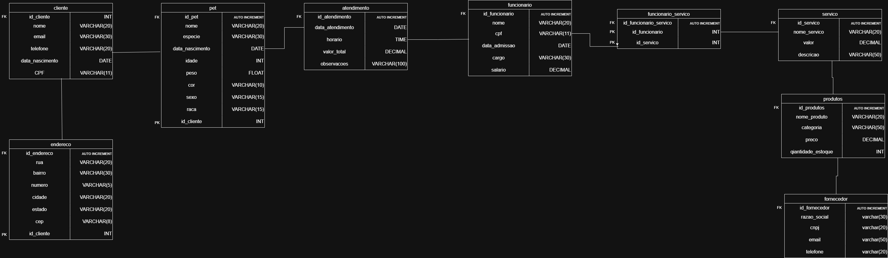
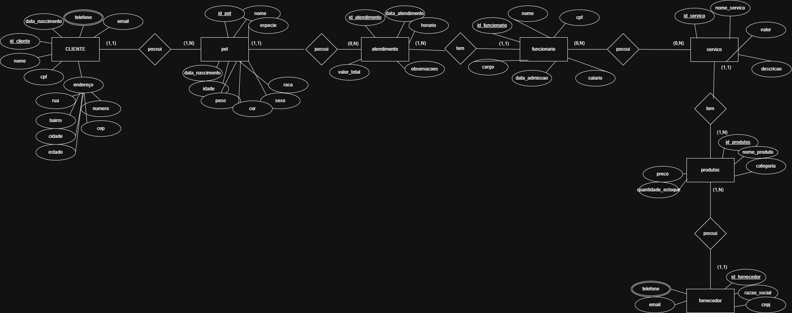
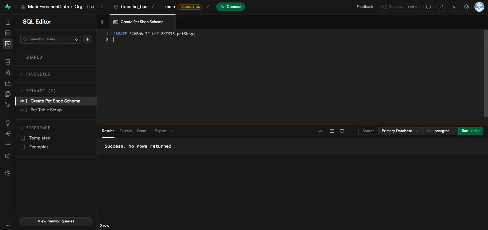
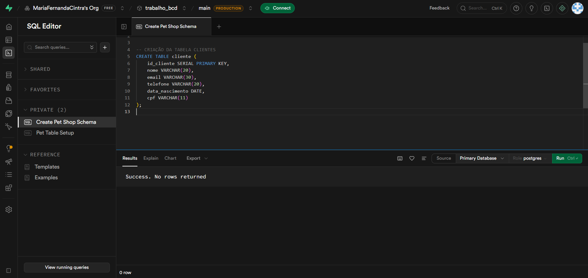
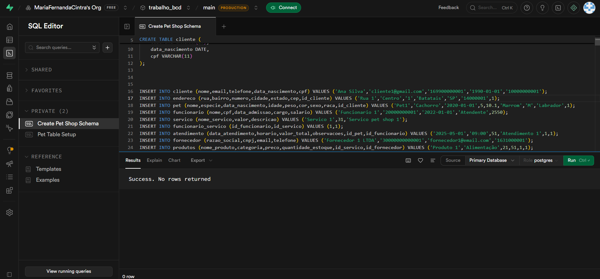
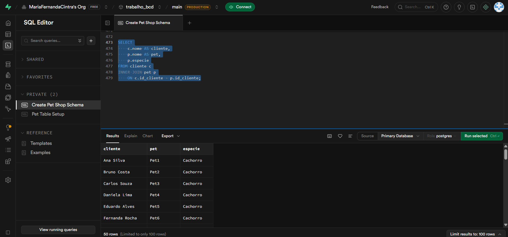
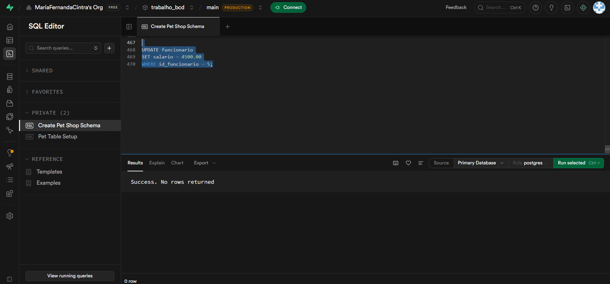
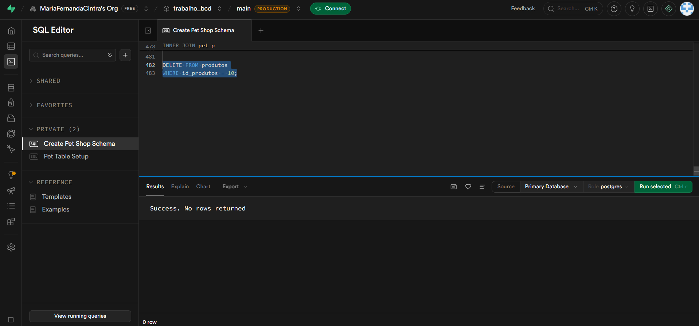

# 🐾 Amigo Fiel - Sistema de Gerenciamento de Pet Shop

## 1. Cenário

O **Pet Shop Amigo Fiel** (nome ilustrativo, podendo ser aplicado a qualquer pet shop que adote essa mesma estrutura) deseja informatizar o controle de seus clientes, pets, funcionários, serviços, produtos e fornecedores.

O sistema foi projetado para atender às seguintes necessidades:

- Cadastro de clientes e seus respectivos endereços;
- Cadastro de pets vinculados a cada cliente;
- Registro de atendimentos realizados nos pets (banho, tosa, consultas veterinárias, etc.);
- Gerenciamento de funcionários e dos serviços que cada um pode realizar;
- Controle do catálogo de serviços oferecidos pelo pet shop;
- Controle de produtos comercializados e seus respectivos fornecedores.

Cada cliente possui dados pessoais e endereço, podendo cadastrar um ou mais pets. Os pets podem receber diversos atendimentos realizados por funcionários do pet shop. A empresa oferece vários serviços, e um funcionário pode realizar vários serviços, assim como um serviço pode ser realizado por diferentes funcionários. Além disso, o pet shop utiliza e comercializa produtos fornecidos por empresas parceiras, e cada produto está vinculado a um fornecedor.

---

## 2. Modelagem Conceitual

Nesta etapa foi realizada a identificação das entidades, atributos e relacionamentos necessários para representar o cenário do pet shop.

### Principais Entidades

- **Cliente** – representa o cliente cadastrado no pet shop;
- **Endereço** – endereço associado ao cliente;
- **Pet** – animal de estimação cadastrado por um cliente;
- **Atendimento** – registro de cada serviço prestado a um pet;
- **Funcionário** – responsável por realizar os atendimentos e serviços;
- **Serviço** – itens do catálogo de serviços oferecidos (banho, tosa, consulta, etc.);
- **Funcionário_Servico** – tabela associativa entre Funcionário e Serviço (N:N);
- **Produto** – itens comercializados pelo pet shop;
- **Fornecedor** – empresas responsáveis pelo fornecimento dos produtos.

### Relacionamentos Identificados

- Um **Cliente** possui um único **Endereço** (1:1);
- Um **Cliente** pode possuir vários **Pets** (1:N);
- Um **Pet** pode possuir vários **Atendimentos** (1:N);
- Um **Atendimento** é vinculado a um **Funcionário** responsável (N:1);
- Um **Funcionário** pode realizar vários **Serviços**, e um **Serviço** pode ser realizado por vários **Funcionários** (relação N:N via tabela intermediária `Funcionario_Servico`);
- Um **Serviço** pode estar relacionado a vários **Produtos** (1:N);
- Um **Produto** pertence a um único **Fornecedor** (1:1).

### DER (Diagrama Entidade Relacionamento)

A imagem abaixo apresenta o Diagrama Entidade Relacionamento (DER) do sistema, representado no padrão **Crow's Foot**. Nele é possível visualizar todas as entidades do banco de dados (cliente, endereço, pet, atendimento, funcionário, funcionario_servico, servico, produtos e fornecedor), seus respectivos atributos e tipos de dados, além das chaves primárias (PK) e estrangeiras (FK) que estabelecem os relacionamentos entre as tabelas.

### MER (Modelo Entidade Relacionamento)

A imagem abaixo apresenta o Modelo Entidade Relacionamento (MER) no padrão **Peter Chen**, evidenciando as entidades (representadas em retângulos), seus atributos (representados em elipses, com os identificadores principais sublinhados) e os relacionamentos (representados em losangos), juntamente com suas respectivas cardinalidades (1:1, 1:N e N:N).

---

## 3. Modelagem Lógica

Após a modelagem conceitual, foi realizada a transformação para o modelo lógico, definindo tabelas, chaves primárias e chaves estrangeiras.

### Tabelas

| Tabela               | Descrição                                                       |
|----------------------|------------------------------------------------------------------|
| `cliente`            | Armazena os dados pessoais dos clientes                          |
| `endereco`           | Armazena o endereço associado a cada cliente                     |
| `pet`                | Armazena os dados dos pets cadastrados pelos clientes            |
| `atendimento`        | Registra os atendimentos realizados em cada pet                  |
| `funcionario`        | Armazena os dados dos funcionários do pet shop                   |
| `servico`            | Armazena os serviços oferecidos pelo pet shop                    |
| `funcionario_servico`| Tabela associativa entre Funcionário e Serviço (N:N)             |
| `produtos`           | Armazena os produtos comercializados pelo pet shop               |
| `fornecedor`         | Armazena os dados dos fornecedores dos produtos                  |

### Estrutura das Tabelas

#### `cliente`

| Coluna           | Tipo         | Observação        |
|------------------|--------------|-------------------|
| `id_cliente`     | INT          | PK, Auto Increment|
| `nome`           | VARCHAR(20)  |                   |
| `email`          | VARCHAR(30)  |                   |
| `telefone`       | VARCHAR(20)  |                   |
| `data_nascimento`| DATE         |                   |
| `CPF`            | VARCHAR(11)  |                   |

#### `endereco`

| Coluna        | Tipo         | Observação                              |
|---------------|--------------|------------------------------------------|
| `id_endereco` | INT          | PK, Auto Increment                       |
| `rua`         | VARCHAR(20)  |                                            |
| `bairro`      | VARCHAR(30)  |                                            |
| `numero`      | VARCHAR(5)   |                                            |
| `cidade`      | VARCHAR(20)  |                                            |
| `estado`      | VARCHAR(20)  |                                            |
| `cep`         | VARCHAR(8)   |                                            |
| `id_cliente`  | INT          | FK → `cliente(id_cliente)` (relação 1:1)  |

#### `pet`

| Coluna           | Tipo         | Observação                            |
|------------------|--------------|------------------------------------------|
| `id_pet`         | INT          | PK, Auto Increment                       |
| `nome`           | VARCHAR(20)  |                                            |
| `especie`        | VARCHAR(30)  |                                            |
| `data_nascimento`| DATE         |                                            |
| `idade`          | INT          |                                            |
| `peso`           | FLOAT        |                                            |
| `cor`            | VARCHAR(10)  |                                            |
| `sexo`           | VARCHAR(15)  |                                            |
| `raca`           | VARCHAR(15)  |                                            |
| `id_cliente`     | INT          | FK → `cliente(id_cliente)` (relação 1:N)  |

#### `atendimento`

| Coluna             | Tipo          | Observação                          |
|--------------------|---------------|----------------------------------------|
| `id_atendimento`   | INT           | PK, Auto Increment                     |
| `data_atendimento` | DATE          |                                          |
| `horario`          | TIME          |                                          |
| `valor_total`      | DECIMAL       |                                          |
| `observacoes`      | VARCHAR(100)  |                                          |
| `id_pet`           | INT           | FK → `pet(id_pet)` (relação N:1)       |
| `cpf` (funcionario)| VARCHAR(11)   | FK → `funcionario(cpf)` (relação N:1)  |

#### `funcionario`

| Coluna           | Tipo         | Observação        |
|------------------|--------------|-------------------|
| `id_funcionario` | INT          | Auto Increment    |
| `nome`           | VARCHAR(20)  |                   |
| `cpf`            | VARCHAR(11)  | PK                |
| `data_admissao`  | DATE         |                   |
| `cargo`          | VARCHAR(30)  |                   |
| `salario`        | DECIMAL      |                   |

#### `servico`

| Coluna         | Tipo         | Observação        |
|----------------|--------------|-------------------|
| `id_servico`   | INT          | PK, Auto Increment|
| `nome_servico` | VARCHAR(20)  |                   |
| `valor`        | DECIMAL      |                   |
| `descricao`    | VARCHAR(50)  |                   |

#### `funcionario_servico`

| Coluna                  | Tipo | Observação                                  |
|-------------------------|------|-----------------------------------------------|
| `id_funcionario_servico`| INT  | Auto Increment                               |
| `id_funcionario`        | INT  | PK/FK → `funcionario(id_funcionario)` (N:N) |
| `id_servico`            | INT  | PK/FK → `servico(id_servico)` (N:N)         |

#### `produtos`

| Coluna              | Tipo         | Observação                                |
|---------------------|--------------|----------------------------------------------|
| `id_produtos`       | INT          | PK, Auto Increment                           |
| `nome_produto`      | VARCHAR(20)  |                                                |
| `categoria`         | VARCHAR(50)  |                                                |
| `preco`             | DECIMAL      |                                                |
| `quantidade_estoque`| INT          |                                                |
| `id_servico`        | INT          | FK → `servico(id_servico)` (relação 1:N)     |
| `id_fornecedor`     | INT          | FK → `fornecedor(id_fornecedor)` (relação 1:1)|

#### `fornecedor`

| Coluna        | Tipo        | Observação        |
|---------------|-------------|-------------------|
| `id_fornecedor`| INT        | PK, Auto Increment|
| `razao_social`| VARCHAR(30) |                   |
| `cnpj`        | VARCHAR(20) |                   |
| `email`       | VARCHAR(50) |                   |
| `telefone`    | VARCHAR(20) |                   |

### Resumo dos Relacionamentos

| Tabela Origem        | Chave Estrangeira | Referência                            | Cardinalidade |
|----------------------|--------------------|-----------------------------------------|---------------|
| `endereco`           | `id_cliente`       | `cliente(id_cliente)`                    | 1:1           |
| `pet`                | `id_cliente`       | `cliente(id_cliente)`                    | 1:N           |
| `atendimento`        | `id_pet`           | `pet(id_pet)`                            | N:1           |
| `atendimento`        | `cpf`              | `funcionario(cpf)`                       | N:1           |
| `funcionario_servico`| `id_funcionario`   | `funcionario(id_funcionario)`            | N:N           |
| `funcionario_servico`| `id_servico`       | `servico(id_servico)`                    | N:N           |
| `produtos`           | `id_servico`       | `servico(id_servico)`                    | 1:N           |
| `produtos`           | `id_fornecedor`    | `fornecedor(id_fornecedor)`              | 1:1           |

---

## 4. Modelagem Física

Nesta etapa foi realizada a implementação do banco de dados utilizando o **Supabase** como SGBD.

### Conceitos Aplicados

Durante a implementação foram utilizados os seguintes conceitos:

- Modelagem de Dados;
- Integridade Referencial;
- Relacionamento 1:1 (ex: Cliente ↔ Endereço, Produto ↔ Fornecedor);
- Relacionamento 1:N (ex: Cliente → Pet, Pet → Atendimento);
- Relacionamento N:N (ex: Funcionário ↔ Serviço via Funcionario_Servico);
- Chaves Primárias e Estrangeiras;
- Normalização de Dados.

### Criação do Schema no Supabase

A imagem abaixo mostra a execução do comando de criação do schema `petShop` no SQL Editor do Supabase, com retorno de sucesso (`Success. No rows returned`), confirmando que o ambiente do banco de dados foi inicializado corretamente.

### Criação das Tabelas

A imagem a seguir exibe a criação da tabela `cliente` no SQL Editor do Supabase, com todos os seus atributos e tipos de dados definidos (`id_cliente`, `nome`, `email`, `telefone`, `data_nascimento` e `cpf`). O mesmo processo foi realizado para todas as demais tabelas do sistema.

---

## 5. CRUD

Foram realizados testes completos de manipulação dos dados utilizando operações CRUD diretamente no Supabase.

### CREATE – Inserção de Dados

Inserção de registros em todas as tabelas do sistema (clientes, endereços, pets, funcionários, serviços, atendimentos, produtos e fornecedores) via comandos `INSERT INTO` executados diretamente no SQL Editor do Supabase.

### READ – Consulta de Dados

Consultas realizadas para verificar os dados cadastrados. A imagem abaixo apresenta um exemplo de consulta com `SELECT` e `INNER JOIN` entre as tabelas `cliente` e `pet`, retornando a listagem de pets por cliente com suas respectivas espécies.

### UPDATE – Atualização de Dados

Atualização de informações previamente cadastradas, como dados de contato de clientes e informações de produtos. A imagem abaixo mostra um exemplo de atualização do salário de um funcionário via comando `UPDATE`, com retorno de sucesso.

### DELETE – Exclusão de Dados

Exclusão de registros das tabelas do sistema. A imagem abaixo demonstra a execução de um comando `DELETE` para remover um produto específico da tabela `produtos` pelo seu `id_produtos`, com retorno de sucesso.

---

## 6. Relatórios

Foram desenvolvidas consultas SQL para extração de informações gerenciais do pet shop, como:

- Listagem de pets por cliente;
- Histórico de atendimentos por pet;
- Serviços realizados por cada funcionário;
- Produtos por fornecedor e categoria;
- Atendimentos realizados em um determinado período;
- Ranking de clientes por quantidade de atendimentos.

---

## Conclusão

O projeto permitiu aplicar conceitos fundamentais de Banco de Dados, desde a modelagem conceitual até a implementação física no Supabase e a realização de operações CRUD. Foram modeladas 9 tabelas com relacionamentos 1:1, 1:N e N:N, garantindo integridade referencial e normalização dos dados. Além disso, foram desenvolvidas consultas capazes de apoiar a gestão do pet shop, garantindo organização, integridade e eficiência no armazenamento e recuperação das informações.
